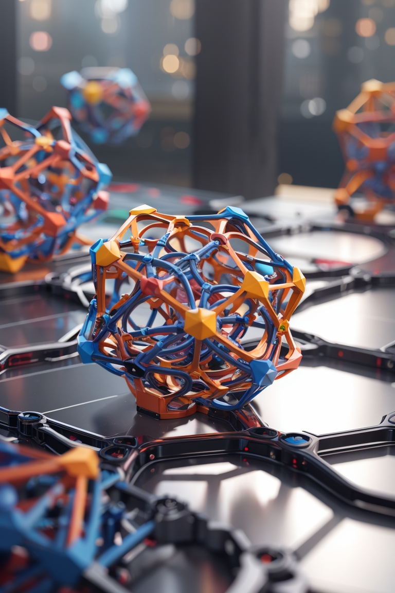

<table>
  <tr>
    <td colspan="2">
      <h1>GLU3D: Generative Lattice Units with 3D Diffusion</h1>
    </td>
  </tr>
  <tr>
    <td width="50%">
      <h2>Abstract:</h2>
      
Architected materials, exhibiting unique mechanical properties derived from their specific designs, have witnessed notable growth in their development due to the extensive design versatility and economical feasibility offered by additive manufacturing techniques. While finite element based methods facilitate accurate evaluation of mechanical response of these structures, identifying new designs based on given mechanical properties involves iterative design optimization and continues to be a challenging task due to computationally expensive simulations often necessitating design expertise. This creates a need for a framework that can generate unique structures given the required mechanical properties thereby eliminating the need for prior experience and expertise. In this work, we present a denoising diffusion-based model that can generate complex structures of unit cells for lattices that can be manufactured using additive manufacturing given the desired mechanical properties. The proposed framework generates unique lattice unit cell structures in the implicit domain which can be easily converted to mesh structures for 3D printing and voxel structures for further structural analysis. We demonstrate the ability of our model to generate unique structures with isotropic as well as anisotropic stiffness, accelerating the design process and can potentially serve as a tool to discover new lattice structures.

    </td>
    <td width="50%" align="right">
      
    </td>
  </tr>
</table>
